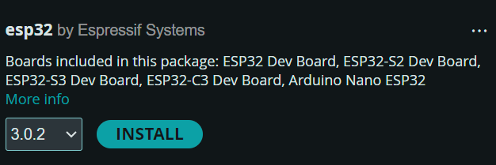
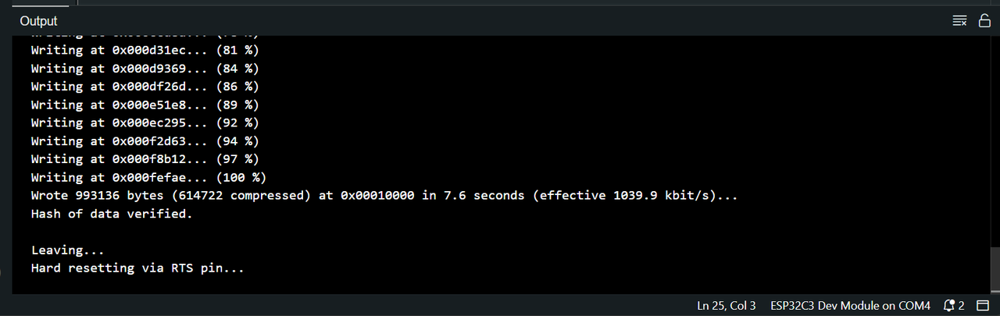

# Introduction

## Project overview

ZimaCube's seventh bay lighting project is an IoT project based on Espressif Systems' ESP32 microcontroller, aimed at achieving lighting control and OTA (Over The Air) update functions.

# Hardware Settings

## Hardware requirements

- ZimaCube's seventh bay
- Type-C data cable
- Windows computer

## Hardware information

Number of lamps: 13
GPIO 2: Connect WS2812B LED light strip data cable.
5V and GND: Power ESP32 development board and connect a ground wire to it.

ESP32 details:

- ESP32 Structure Diagram: Hardware/ESP32-C3 Dimensions.png
- ESP32 Schematics: Hardware/ESP32_C3 Schematic.png
- Altium Designer file for ESP32: Hardware/Super Mini-ESP32C3-Form Factor. PcbDoc esp

# User guide

## System requirements

Operating System: Windows
Necessary tools: Arduino

## Installation steps

1. Install Arduino https://www.arduino.cc/en/software
2. Install ESP32 board
   
   
   
4. Download and install the library file
   
   Download the Adafruit_NeoPixel, ArduinoJson, Metro files in the Library and place them in Arduino's libraries .

### Basic use

1. Open the Arduino IDE and load the `.ino` file in the project
2. Select Development Board: `Tools - >  Board: - > ESP32 - > ESP32C3 Dev Module`
3. Choose the correct serial port: `Tools - >  Port`
4. Compile and upload code to ESP32: Click `Upload` button
5. Run and wait for the result
   

### Control method - Wi-Fi

Connecting to ZimaCube's Wi-Fi：

Wi-Fi Name: "ZimaCube"

Wi-Fi password: "homecloud"

Send a POST request to the IP Address 172.16.1.1 to implement control.

We have set five modes to control the light strip : 'id '= 1~ 5

```
Id = 1 breathing pattern
Id = 2 always on 
Id = 3 needs to be developed
Id = 4 needs to be developed
Id = 5 custom mode
```

#### Breathing pattern control mode

```
In breathing mode, the light strip presents a monochromatic gradual change effect, and the speed of gradual change can be adjusted by 0~ 10.
```

Change the color of the lamp by adjusting Hue, Saturation, and Value
Range of parameters:

```
H = 0~ 365
S = 0~ 255
V = 0~ 255
```

Here is an example of JSON format data for controlling lighting:

```
{
      "id":1,
      "speed":4,
      "data":[
          {"h":32,"s":255,"v":255}
      ]
}
```

Python script example path: ControlExample/Mode_1.py

#### Always-on mode control mode

Here is an example of JSON format data for controlling lighting:

```
{
      "id":2,
      "data":[
          {"h":32,"s":255,"v":255}
      ]
}
```

Python script path: ControlExample/Mode_2.py

#### To be developed

#### To be developed

#### Control method for custom mode

In custom mode, you can control the color and brightness of each lamp.
Here is an example of JSON format data for controlling lighting:

```
{
  "id": 5,
  "data": [
    {"h": 32, "s": 255, "v":255},
    {"h": 32, "s": 255, "v":255},
    {"h": 32, "s": 255, "v":255},   
    {"h": 32, "s": 255, "v":255},   
    {"h": 32, "s": 255, "v":255},  
    {"h": 32, "s": 255, "v":255},    
    {"h": 32, "s": 255, "v":255},    
    {"h": 32, "s": 255, "v":255},
    {"h": 32, "s": 255, "v":255},
    {"h": 32, "s": 255, "v":255},
    {"h": 32, "s": 255, "v":255},
    {"h": 32, "s": 255, "v":255},
    {"h": 32, "s": 255, "v":255}
  ]
}
```

Python script path: ControlExample/Mode_5.py

### OTA Update Tutorial

- Connect to Wi-Fi
  Connect to Wi-Fi with a computer.

```
Name: "ZimaCube"
Password: "homecloud"
```

- Enter URL
  Enter in the browser: 172.16.1.1

- Upload firmware
  

## Configuration guide

- Configure Wi-Fi parameters

```
const char *ssid = "your-ssid";      // Enter SSID here
const char *password = "your-password"; // Enter Password here
```

- Configure IP address and port

```
/* Put IP Address details */
IPAddress local_ip(172, 16, 1, 1);      // Enter IP Address here
IPAddress gateway(172, 16, 1, 1);       // Enter Gateway here
IPAddress subnet(255, 255, 255, 0);     // Enter Subnet here

WebServer server(80);                   // Enter Port here
```


